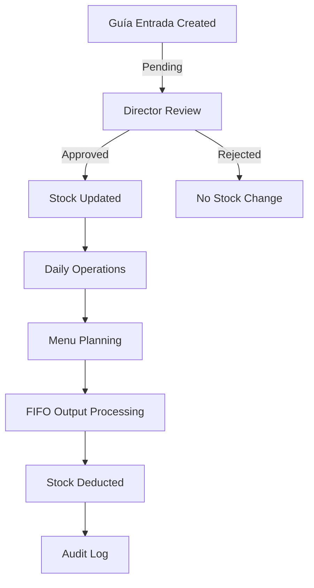

## Database Overview

The PAE Inventory System uses **PostgreSQL** via **Supabase** as its database platform. The schema is designed to manage school meal program operations including inventory control, meal planning, attendance tracking, and user management with role-based access control.

### Schema Version

- **Last Updated**: February 23, 2026
- **Database**: PostgreSQL (Supabase)
- **Schema File**: `supabase_schema.sql`

## Architecture Principles

### 1. Role-Based Access Control (RBAC)

The system implements a hierarchical role structure:

- **Desarrollador (id=4)**: Full system administrator (assigned only from database)
- **Director (id=1)**: School administrator with approval permissions
- **Madre Procesadora (id=2)**: Kitchen manager with operational access
- **Supervisor (id=3)**: Read-only supervision access

### 2. Maker-Checker Pattern

Guía de Entrada (delivery guides) follow a two-step approval workflow:

1. **Madre Procesadora** creates and submits guides
2. **Director** or **Desarrollador** approves/rejects guides
3. Only approved guides update inventory stock

### 3. FIFO Inventory Management

The system implements First-In-First-Out (FIFO) inventory tracking:

- Batch/lot tracking with expiration dates stored as JSONB
- Automatic consumption from oldest batches first
- Expiration alerts and reporting

### 4. Audit Trail

Comprehensive audit logging captures:

- User actions (INSERT, UPDATE, DELETE)
- Approval/rejection events
- Stock movements
- User authentication and activity

## Core Data Flow



## Table Categories

### User Management
- `rol` - User roles and permissions
- `users` - User accounts (extends Supabase auth.users)
- `audit_log` - System audit trail

### Inventory Management
- `category` - Product categories
- `product` - Product catalog with stock levels
- `guia_entrada` - Delivery guides (with approval workflow)
- `input` - Delivery guide line items with batch tracking
- `output` - Stock withdrawals

### Daily Operations
- `registro_diario` - Daily meal records (current)
- `receta_porcion` - Product yield/portion configuration
- `asistencia_diaria` - Student attendance (legacy)
- `menu_diario` - Daily menu (legacy)
- `menu_detalle` - Menu line items (legacy)

<Note>
The `asistencia_diaria`, `menu_diario`, and `menu_detalle` tables are legacy tables replaced by the unified `registro_diario` table. They are maintained for backward compatibility.
</Note>

## Security Architecture

### Row Level Security (RLS)

All tables have RLS enabled with policies based on user roles:

- **SELECT**: Generally open to all authenticated users
- **INSERT**: Restricted to Director and Madre Procesadora
- **UPDATE**: Role-specific (varies by table)
- **DELETE**: Highly restricted (Director only on most tables)

See [Security & RLS Policies](/database/security) for complete policy details.

### Trigger-Based Protection

Critical business rules are enforced via PostgreSQL triggers:

- **User hierarchy protection**: Prevents unauthorized role modifications
- **Stock validation**: Ensures sufficient inventory before withdrawals
- **Automatic timestamps**: Updates `updated_at` fields
- **Audit logging**: Automatic capture of all critical operations

## Key Features

### 1. Transactional Integrity

All critical operations use PostgreSQL functions with `SECURITY DEFINER`:

- `aprobar_guia()` - Atomic approval and stock update
- `rechazar_guia()` - Rejection with audit trail
- `procesar_operacion_diaria()` - FIFO-based meal operation processing

### 2. JSONB for Flexibility

Batch tracking uses JSONB for flexible data structures:

```json
[
  {
    "cantidad": 50.00,
    "fecha_vencimiento": "2026-06-30"
  },
  {
    "cantidad": 30.00,
    "fecha_vencimiento": "2026-07-15"
  }
]
```

### 3. Materialized Views

Pre-computed views for common queries:

- `productos_stock_bajo` - Low stock alerts
- `inventario_actual` - Current inventory status
- `guias_pendientes` - Pending approvals
- `historial_aprobaciones` - Approval history

## Performance Optimizations

### Indexes

- `idx_guia_entrada_estado` - Fast filtering by approval status
- `idx_input_lotes_detalle` - GIN index for JSONB batch queries
- Primary key indexes on all tables
- Foreign key indexes automatically created

### Locking Strategy

- `SELECT FOR UPDATE` used in FIFO processing to prevent race conditions
- Row-level locking for concurrent operations
- Transaction isolation for critical workflows

## Database Constraints

### Data Integrity

- `CHECK` constraints for valid data ranges (stock >= 0, amount > 0)
- `UNIQUE` constraints for business keys (numero_guia_sunagro, username)
- `NOT NULL` constraints for required fields
- Foreign key cascades for referential integrity

### Business Rules

- Unique guía numbers per delivery
- One attendance record per date/shift combination
- Stock cannot go negative (enforced by triggers)
- Approval state transitions (Pending → Approved/Rejected only)

## Migration & Deployment

<Warning>
The `supabase_schema.sql` file is **reference documentation only**. The database is already deployed in production. Do not execute this file directly against the production database.
</Warning>

For schema changes:

1. Test in development environment
2. Create migration scripts
3. Apply via Supabase CLI or Dashboard
4. Update reference documentation

## Related Documentation

- [Database Tables Reference](/database/tables) - Detailed table schemas
- [PostgreSQL Functions](/database/functions) - RPC functions and triggers
- [Security & RLS Policies](/database/security) - Access control policies