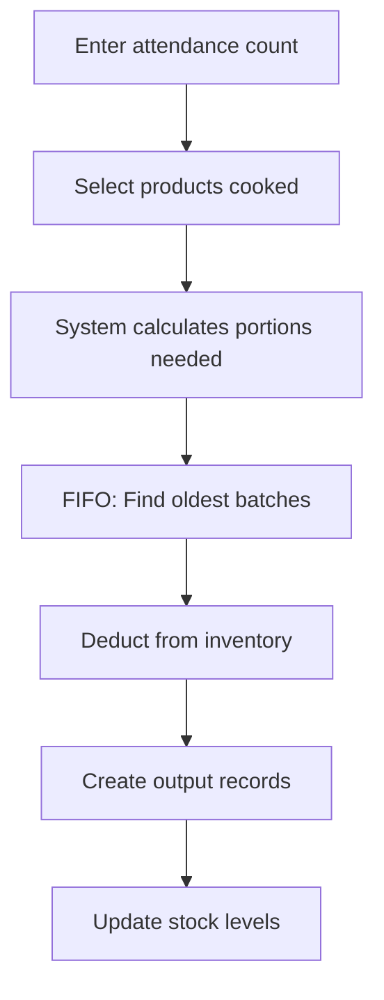

## Overview

The Daily Operations module (Registro Diario) is where you record:
- Student attendance for each meal service
- Which products (rubros) were cooked
- Automatic inventory consumption using FIFO batch tracking

This is the **primary way** inventory is consumed in the system.

<Note>
**Required Role:** Director or Madre Procesadora

Supervisors can view operations but cannot create them.
</Note>

## How Daily Operations Work



### Automatic Calculations

1. **You provide:** Attendance count + Products cooked
2. **System calculates:** Quantity needed = attendance ÷ portion yield
3. **System consumes:** Uses FIFO to deduct from oldest batches first
4. **System updates:** Stock levels decrease automatically

<Tip>
Before you can use a product in daily operations, you must configure its **portion yield** in the Porciones module.

See: [Portion Management](/guides/portion-management)
</Tip>

## Registering a Daily Operation

<Steps>
  <Step title="Navigate to Daily Operations">
    Go to **Operaciones > Registro Diario** from the main menu.
  </Step>
  
  <Step title="Click 'Nueva Operación'">
    Click the **+ Nueva Operación** button in the top-right corner.
  </Step>
  
  <Step title="Enter operation details">
    Fill in the basic information:
    
    - **Fecha**: Date of the meal service (defaults to today)
    - **Turno**: Select the meal period:
      - Desayuno (Breakfast)
      - Almuerzo (Lunch)
      - Merienda (Snack)
    - **Asistencia (alumnos)**: Number of students present
  </Step>
  
  <Step title="Add products cooked">
    For each product used:
    
    1. Click **+ Agregar Rubro**
    2. Select the product from the dropdown
    3. The system will show:
       - Current stock level
       - Calculated quantity needed (based on attendance)
       - Whether stock is sufficient
  </Step>
  
  <Step title="Verify calculations">
    The system displays real-time feedback for each product:
    
    ✓ **Green check** = Sufficient stock available
    
    ⚠️ **Red warning** = Insufficient stock
    
    Example:
    - Product: Arroz (stock: 100 kg)
    - Attendance: 120 students
    - Portion yield: 12 portions/kg
    - Calculation: 120 ÷ 12 = **10 kg needed**
    - Result: ✓ 10.00 kg necesarios
  </Step>
  
  <Step title="Submit the operation">
    Click **🍴 Registrar Operación**.
    
    The system will:
    1. Create a registro_diario record
    2. Calculate exact quantities needed for each product
    3. Use FIFO to consume batches (oldest first)
    4. Create output records for each product
    5. Deduct quantities from stock
    
    <Info>
    Success message:
    
    "Operación registrada: 3 rubros procesados para 120 alumnos."
    </Info>
  </Step>
</Steps>

## Example from Code (RegistroDiario.jsx:117-160)

```javascript
const handleSubmit = async (e) => {
  e.preventDefault()

  if (rubrosSeleccionados.length === 0) {
    notifyError('Sin rubros', 'Debe agregar al menos un rubro para cocinar')
    return
  }

  const rubrosValidos = rubrosSeleccionados.filter(r => r.id_product)
  if (rubrosValidos.length === 0) {
    notifyError('Sin rubros', 'Seleccione al menos un rubro válido')
    return
  }

  // Check for duplicates
  const ids = rubrosValidos.map(r => parseInt(r.id_product))
  if (new Set(ids).size !== ids.length) {
    notifyError('Rubros duplicados', 'No puede seleccionar el mismo rubro más de una vez')
    return
  }

  setSubmitting(true)

  try {
    // Call RPC function to process the operation
    const { data, error } = await supabase.rpc('procesar_operacion_diaria', {
      p_fecha: formData.fecha,
      p_turno: formData.turno,
      p_asistencia: parseInt(formData.asistencia_total),
      p_rubros: ids  // Array of product IDs
    })

    if (error) throw error

    notifySuccess('Operación registrada', data?.mensaje || 'Se procesó correctamente')
    resetForm()
    loadRegistros()
    loadProductosConRendimiento()
  } catch (error) {
    console.error('Error procesando operación:', error)
    notifyError('Error al procesar', error.message)
  } finally {
    setSubmitting(false)
  }
}
```

## Real-Time Calculation Display (RegistroDiario.jsx:103-114)

```javascript
const getCalculoRubro = (idProduct) => {
  if (!idProduct || !formData.asistencia_total) return null
  
  const porcion = productosConRendimiento.find(p => p.id_product === parseInt(idProduct))
  if (!porcion) return null
  
  const cantidad = parseFloat(formData.asistencia_total) / porcion.rendimiento_por_unidad
  
  return {
    cantidad: cantidad.toFixed(2),
    unit: porcion.product.unit_measure,
    stock: porcion.product.stock,
    nombre: porcion.product.product_name,
    suficiente: porcion.product.stock >= cantidad  // ← Check if sufficient
  }
}
```

This calculation happens **before submission** to warn you of insufficient stock.

## Database Processing Function

The core logic is handled by the `procesar_operacion_diaria()` RPC function.

### procesar_operacion_diaria() (supabase_schema.sql:570-706)

```sql
CREATE OR REPLACE FUNCTION procesar_operacion_diaria(
  p_fecha DATE,
  p_turno TEXT,
  p_asistencia INTEGER,
  p_rubros INTEGER[]  -- Array of product IDs
)
RETURNS JSON
LANGUAGE plpgsql
SECURITY DEFINER
AS $$
DECLARE
  v_id_registro INTEGER;
  v_rubro_id INTEGER;
  v_rendimiento NUMERIC(10,2);
  v_cantidad_necesaria NUMERIC(10,2);
  v_restante NUMERIC(10,2);
  v_lote RECORD;
  v_consumir NUMERIC(10,2);
  v_total_rubros INTEGER := 0;
  v_user_role INTEGER;
  v_product_name TEXT;
BEGIN
  -- Verify permissions
  SELECT id_rol INTO v_user_role FROM users WHERE id_user = auth.uid();
  IF v_user_role IS NULL OR v_user_role NOT IN (1, 2, 4) THEN
    RAISE EXCEPTION 'No tiene permisos para registrar operaciones diarias.';
  END IF;

  -- Create registro_diario record
  INSERT INTO registro_diario (fecha, turno, asistencia_total, created_by)
  VALUES (p_fecha, p_turno, p_asistencia, auth.uid())
  RETURNING id_registro INTO v_id_registro;

  -- Process each product
  FOREACH v_rubro_id IN ARRAY p_rubros
  LOOP
    -- Get portion yield
    SELECT rendimiento_por_unidad INTO v_rendimiento
    FROM receta_porcion WHERE id_product = v_rubro_id;

    IF v_rendimiento IS NULL OR v_rendimiento <= 0 THEN
      SELECT product_name INTO v_product_name FROM product WHERE id_product = v_rubro_id;
      RAISE EXCEPTION 'El rubro "%" no tiene rendimiento configurado.', v_product_name;
    END IF;

    -- Calculate quantity needed
    v_cantidad_necesaria := ROUND(p_asistencia::NUMERIC / v_rendimiento, 2);
    v_restante := v_cantidad_necesaria;

    -- Lock relevant batch rows (FIFO)
    PERFORM NULL
    FROM input i
    JOIN guia_entrada g ON i.id_guia = g.id_guia
    WHERE i.id_product = v_rubro_id
      AND g.estado = 'Aprobada'
      AND i.lotes_detalle IS NOT NULL
      AND jsonb_array_length(i.lotes_detalle) > 0
    FOR UPDATE OF i;

    -- Consume using FIFO (oldest expiration dates first)
    FOR v_lote IN
      SELECT
        i.id_input,
        (lote.value->>'cantidad')::NUMERIC(10,2) AS cantidad_lote,
        (lote.value->>'fecha_vencimiento')::DATE AS fecha_venc,
        (lote.ordinality - 1)::INTEGER AS lote_idx
      FROM input i
      JOIN guia_entrada g ON i.id_guia = g.id_guia
      CROSS JOIN LATERAL jsonb_array_elements(i.lotes_detalle) WITH ORDINALITY AS lote
      WHERE i.id_product = v_rubro_id
        AND g.estado = 'Aprobada'
        AND i.lotes_detalle IS NOT NULL
        AND jsonb_array_length(i.lotes_detalle) > 0
        AND (lote.value->>'cantidad')::NUMERIC > 0
      ORDER BY (lote.value->>'fecha_vencimiento')::DATE ASC, i.id_input ASC  -- ← FIFO ordering
    LOOP
      EXIT WHEN v_restante <= 0;

      -- Consume from this batch
      v_consumir := LEAST(v_lote.cantidad_lote, v_restante);

      -- Update batch quantity
      UPDATE input
      SET lotes_detalle = jsonb_set(
        lotes_detalle,
        ARRAY[v_lote.lote_idx::TEXT, 'cantidad'],
        to_jsonb(v_lote.cantidad_lote - v_consumir)
      )
      WHERE id_input = v_lote.id_input;

      v_restante := v_restante - v_consumir;
    END LOOP;

    -- Check if we consumed enough
    IF v_restante > 0.01 THEN
      SELECT product_name INTO v_product_name FROM product WHERE id_product = v_rubro_id;
      RAISE EXCEPTION 'Lotes insuficientes para "%". Faltan % unidades.',
        v_product_name, ROUND(v_restante, 2);
    END IF;

    -- Insert output record (trigger will update stock)
    INSERT INTO output (id_product, amount, fecha, motivo, id_registro, created_by)
    VALUES (
      v_rubro_id,
      v_cantidad_necesaria,
      p_fecha,
      format('%s - %s alumnos', p_turno, p_asistencia),
      v_id_registro,
      auth.uid()
    );

    v_total_rubros := v_total_rubros + 1;
  END LOOP;

  -- Audit log
  INSERT INTO audit_log (id_user, action_type, table_affected, record_id, details)
  VALUES (auth.uid(), 'INSERT', 'registro_diario', v_id_registro,
    jsonb_build_object(
      'fecha', p_fecha,
      'turno', p_turno,
      'asistencia', p_asistencia,
      'rubros', p_rubros,
      'total_rubros', v_total_rubros
    )::text
  );

  RETURN json_build_object(
    'success', true,
    'id_registro', v_id_registro,
    'rubros_procesados', v_total_rubros,
    'mensaje', format('Operacion registrada: %s rubros procesados para %s alumnos.',
      v_total_rubros, p_asistencia)
  );
EXCEPTION
  WHEN OTHERS THEN
    RAISE EXCEPTION '%', SQLERRM;
END;
$$;
```

### Key Features:

1. **Permission check** - Only Director/Madre Procesadora can register
2. **Portion validation** - All products must have configured yields
3. **FIFO consumption** - Oldest batches consumed first
4. **Batch locking** - Uses `FOR UPDATE` to prevent race conditions
5. **Stock deduction** - Automatic via `update_stock_on_output()` trigger
6. **Atomic transaction** - All or nothing (rolls back on error)

## Stock Deduction Trigger (supabase_schema.sql:293-322)

When an output record is created, this trigger automatically updates stock:

```sql
CREATE OR REPLACE FUNCTION update_stock_on_output()
RETURNS TRIGGER AS $$
DECLARE
    v_stock_actual NUMERIC(10,2);
BEGIN
    -- Lock the product row
    SELECT stock INTO v_stock_actual
    FROM product
    WHERE id_product = NEW.id_product
    FOR UPDATE;

    -- Check for sufficient stock
    IF v_stock_actual < NEW.amount THEN
        RAISE EXCEPTION 'Stock insuficiente para el producto %. Stock actual: %, solicitado: %',
            NEW.id_product, v_stock_actual, NEW.amount;
    END IF;

    -- Deduct from stock
    UPDATE product
    SET stock = stock - NEW.amount
    WHERE id_product = NEW.id_product;

    RETURN NEW;
END;
$$ LANGUAGE plpgsql;

DROP TRIGGER IF EXISTS trigger_update_stock_output ON output;
CREATE TRIGGER trigger_update_stock_output
    AFTER INSERT ON output
    FOR EACH ROW
    EXECUTE FUNCTION update_stock_on_output();
```

This ensures:
- Stock cannot go negative
- Updates are atomic
- Errors are raised if insufficient stock

## Viewing Operation History

The bottom section of the Registro Diario page shows all past operations:

- Date and meal period (Desayuno/Almuerzo/Merienda)
- Attendance count
- Who registered the operation
- Expandable detail showing all products consumed

### Example from Code (RegistroDiario.jsx:61-76)

```javascript
const loadDetallesRegistro = async (idRegistro) => {
  if (detallesRegistro[idRegistro]) return

  try {
    const { data, error } = await supabase
      .from('output')
      .select('*, product(product_name, unit_measure)')
      .eq('id_registro', idRegistro)
      .order('id_output')

    if (error) throw error
    setDetallesRegistro(prev => ({ ...prev, [idRegistro]: data || [] }))
  } catch (error) {
    console.error('Error cargando detalles:', error)
  }
}
```

## Common Errors and Solutions

<AccordionGroup>
  <Accordion title="Error: 'El rubro no tiene rendimiento configurado'">
    **Cause:** You selected a product that doesn't have a portion yield set up.
    
    **Solution:** Go to **Configuración > Porciones** and configure the portion yield for this product first.
    
    See: [Portion Management](/guides/portion-management)
  </Accordion>
  
  <Accordion title="Error: 'Lotes insuficientes para [producto]'">
    **Cause:** Not enough inventory stock to fulfill the calculated quantity.
    
    **Example:** Need 15 kg of Arroz, but only 10 kg available in approved batches.
    
    **Solution:**
    1. Check if there are pending entry guides that need approval
    2. Reduce the attendance count or remove this product
    3. Request a new delivery of this product
  </Accordion>
  
  <Accordion title="Warning: Red warning icon shows insufficient stock">
    **Cause:** The real-time calculation detected you don't have enough stock.
    
    **Solution:** This is a **pre-submission warning**. The system will block submission if you try to proceed. Either:
    - Remove this product from the list
    - Get more stock approved first
  </Accordion>
  
  <Accordion title="Can't select a product in the dropdown">
    **Cause:** The product doesn't have a configured portion yield.
    
    **Solution:** Only products with portion yields appear in the dropdown. Configure the yield first in **Porciones**.
  </Accordion>
</AccordionGroup>

## Best Practices

<AccordionGroup>
  <Accordion title="Register operations on the same day">
    Record meal services on the day they occur. This keeps inventory data current and accurate.
  </Accordion>
  
  <Accordion title="One operation per turno per day">
    Create separate operations for each meal period:
    - Desayuno (morning)
    - Almuerzo (midday)
    - Merienda (afternoon)
    
    Don't combine multiple meal periods into one operation.
  </Accordion>
  
  <Accordion title="Verify attendance counts">
    Double-check the student count before submitting. Incorrect attendance leads to incorrect inventory consumption.
  </Accordion>
  
  <Accordion title="Configure portion yields before cooking season starts">
    Set up all portion yields at the beginning of the school year. This prevents errors during busy meal service times.
  </Accordion>
  
  <Accordion title="Check stock levels before meal planning">
    Use the Products page to verify you have sufficient stock of all planned items before starting food preparation.
  </Accordion>
</AccordionGroup>

## Related Resources

<CardGroup cols={2}>
  <Card title="Portion Management" icon="utensils" href="/guides/portion-management">
    Configure how many servings each product yields
  </Card>
  <Card title="FIFO System" icon="layer-group" href="/guides/fifo-system">
    How batch tracking ensures oldest items are used first
  </Card>
  <Card title="Managing Products" icon="box" href="/guides/managing-products">
    View stock levels and product information
  </Card>
  <Card title="Entry Approval" icon="check-circle" href="/guides/entry-approval-workflow">
    How to add inventory through approved entry guides
  </Card>
</CardGroup>