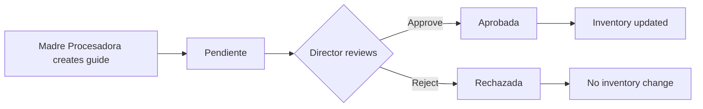

## Overview

The PAE Inventory System implements a **maker-checker approval workflow** for all inventory entries. This ensures that no inventory is added to stock without proper authorization and review.

<Note>
**Key Principle:** Separation of duties

The person who creates an entry guide (maker) cannot approve it themselves. A Director must review and approve it (checker).
</Note>

## Workflow States

Every entry guide (guía de entrada) exists in one of three states:



### 1. Pendiente (Pending)

**Status:** Entry guide created but not yet reviewed

**Inventory Impact:** None - stock levels remain unchanged

**Who can create:** Madre Procesadora or Director

**Displayed as:**
<span style={{padding: '0.5rem 1rem', background: '#fef3c7', color: '#92400e', borderRadius: '6px', fontWeight: '600'}}>⏱️ PENDIENTE</span>

### 2. Aprobada (Approved)

**Status:** Director has reviewed and approved the entry

**Inventory Impact:** Stock quantities are **added immediately** upon approval

**Who can approve:** Director or Desarrollador only

**Displayed as:**
<span style={{padding: '0.5rem 1rem', background: '#d1fae5', color: '#065f46', borderRadius: '6px', fontWeight: '600'}}>✓ APROBADA</span>

### 3. Rechazada (Rejected)

**Status:** Director has reviewed and rejected the entry

**Inventory Impact:** None - stock levels remain unchanged

**Who can reject:** Director or Desarrollador only

**Requires:** A reason/comment explaining why it was rejected

**Displayed as:**
<span style={{padding: '0.5rem 1rem', background: '#fee2e2', color: '#991b1b', borderRadius: '6px', fontWeight: '600'}}>✗ RECHAZADA</span>

## Creating an Entry Guide (Maker Role)

<Note>
**Required Role:** Madre Procesadora or Director
</Note>

<Steps>
  <Step title="Navigate to Entry Guides">
    Go to **Operaciones > Guías de Entrada** from the main menu.
  </Step>
  
  <Step title="Click 'Nueva Guía'">
    Click the **+ Nueva Guía** button in the top-right corner.
  </Step>
  
  <Step title="Fill in guide header information">
    Enter the required information:
    
    - **Nº Guía SUNAGRO** (required): The official SUNAGRO guide number (must be unique)
    - **Nº Guía SISECAL** (optional): The SISECAL guide number if applicable
    - **Fecha de Entrega** (required): Date the products were received
    - **Vocera que Recibió** (required): Name of the person who received the delivery
    - **Teléfono de Contacto** (optional): Contact phone number
    - **Observaciones Generales** (optional): Any notes about the delivery
  </Step>
  
  <Step title="Add products (rubros)">
    For each product received:
    
    1. Click **+ Agregar Rubro**
    2. Select the product from the dropdown
    3. Enter **Cantidad Total** (total amount received)
    4. Enter **Bultos** (optional - number of physical packages/sacks)
  </Step>
  
  <Step title="Register batch information (FIFO)">
    For each product, you **must** register batch/lot information:
    
    1. Click **+ Agregar Lote** if there are multiple expiration dates
    2. Enter **Cantidad Lote** (amount in this batch)
    3. Enter **Vencimiento / Vida Útil** (expiration date)
    
    <Warning>
    The sum of all batch quantities must equal the total product amount, or the system will reject the submission.
    </Warning>
    
    See: [FIFO Batch Tracking](/guides/fifo-system)
  </Step>
  
  <Step title="Submit the guide">
    Click **Registrar Guía (Pendiente)**. The guide will be created with status "Pendiente".
    
    <Info>
    You will see a confirmation message:
    
    "Guía #91 registrada. Estado: Pendiente de aprobación. El inventario se actualizará cuando el Director la apruebe."
    </Info>
  </Step>
</Steps>

### Example from Code (GuiasEntrada.jsx:150-237)

```javascript
const handleSubmit = async (e) => {
  e.preventDefault()

  if (detalles.length === 0) {
    notifyWarning('Campo requerido', 'Debe agregar al menos un rubro')
    return
  }

  // Validate that batch quantities match total
  for (let i = 0; i < detalles.length; i++) {
    const detalle = detalles[i]
    const sumaLotes = detalle.lotes.reduce((sum, lote) => sum + parseFloat(lote.cantidad || 0), 0)
    const cantidadTotal = parseFloat(detalle.amount || 0)

    if (Math.abs(sumaLotes - cantidadTotal) > 0.01) {
      notifyWarning('Lotes no coinciden', 
        `Rubro ${i + 1}: La suma de lotes (${sumaLotes}) no coincide con la cantidad total (${cantidadTotal})`)
      return
    }
  }

  try {
    const user = await getCurrentUser()

    // Insert guide in PENDING state
    const { data: guiaData, error: guiaError } = await supabase
      .from('guia_entrada')
      .insert({
        numero_guia_sunagro: formData.numero_guia_sunagro,
        numero_guia_sisecal: formData.numero_guia_sisecal || null,
        fecha: formData.fecha,
        vocera_nombre: formData.vocera_nombre,
        telefono_vocera: formData.telefono_vocera || null,
        notas: formData.notas || null,
        created_by: user.id,
        estado: 'Pendiente'  // ← Created in pending state
      })
      .select()
      .single()

    if (guiaError) throw guiaError

    // Insert product details with batch information
    const inputData = detalles.map(detalle => ({
      id_guia: guiaData.id_guia,
      id_product: parseInt(detalle.id_product),
      amount: parseFloat(detalle.amount),
      unit_amount: detalle.unit_amount ? parseInt(detalle.unit_amount) : null,
      fecha: formData.fecha,
      lotes_detalle: detalle.lotes.map(lote => ({
        cantidad: parseFloat(lote.cantidad),
        fecha_vencimiento: lote.fecha_vencimiento
      }))
    }))

    const { error: inputError } = await supabase
      .from('input')
      .insert(inputData)

    if (inputError) throw inputError

    notifySuccess('Guía registrada', 
      `Guía #${formData.numero_guia_sunagro} registrada. Estado: Pendiente de aprobación.`)

    resetForm()
    loadGuias()
  } catch (error) {
    console.error('Error guardando guía:', error)
    notifyError('Error al guardar guía', error.message)
  }
}
```

## Approving an Entry Guide (Checker Role)

<Note>
**Required Role:** Director or Desarrollador only
</Note>

<Steps>
  <Step title="Navigate to Approve Guides">
    Go to **Operaciones > Aprobar Guías** from the main menu.
  </Step>
  
  <Step title="Review pending guides">
    The page displays all guides with status "Pendiente". Each guide shows:
    - Guide number (SUNAGRO and SISECAL)
    - Date received
    - Person who created it
    - Vocera who received the delivery
    - All products with quantities and batch information
    - **Projected stock** after approval
  </Step>
  
  <Step title="Verify the information">
    Check that:
    - Guide numbers are correct
    - Product quantities match the physical delivery
    - Batch/expiration dates are reasonable
    - All required information is present
  </Step>
  
  <Step title="Approve or reject">
    Click either:
    - **✓ Aprobar y Actualizar Inventario** - to approve
    - **✗ Rechazar** - to reject
  </Step>
  
  <Step title="Add comments (if needed)">
    A confirmation modal appears:
    - For **approval**: Comments are optional
    - For **rejection**: You **must** provide a reason
  </Step>
  
  <Step title="Confirm the action">
    Click **Confirmar Aprobación** or **Confirmar Rechazo**.
    
    If approved, the system will:
    1. Update the guide status to "Aprobada"
    2. Add all product quantities to inventory stock
    3. Record the approval in the audit log
    4. Display confirmation: "Guía #91 aprobada. 5 rubros actualizados en inventario."
  </Step>
</Steps>

### Approval Logic (AprobarGuias.jsx:81-110)

```javascript
const handleAprobar = async () => {
  if (!guiaSeleccionada) return

  // Verify user has Director or Desarrollador role
  if (userRole !== 1 && userRole !== 4) {
    notifyWarning('Sin permisos', 'Solo el Director puede aprobar guías')
    return
  }

  setLoading(true)

  try {
    // Call RPC function for approval
    const { data, error } = await supabase.rpc('aprobar_guia', {
      p_id_guia: guiaSeleccionada.id_guia,
      p_comentarios: comentarios || null
    })

    if (error) throw error

    notifySuccess('Guía aprobada', 
      `Guía #${guiaSeleccionada.numero_guia_sunagro} aprobada. ${data.productos_procesados} rubros actualizados en inventario.`)

    cerrarModal()
    loadGuiasPendientes()
  } catch (error) {
    console.error('Error al aprobar guía:', error)
    notifyError('Error al aprobar', error.message)
  } finally {
    setLoading(false)
  }
}
```

## Database-Level Approval Function

The approval process is handled by a secure PostgreSQL function that ensures atomicity.

### aprobar_guia() Function (supabase_schema.sql:414-477)

```sql
CREATE OR REPLACE FUNCTION aprobar_guia(
  p_id_guia INTEGER,
  p_comentarios TEXT DEFAULT NULL
)
RETURNS JSON
LANGUAGE plpgsql
SECURITY DEFINER
AS $$
DECLARE
  v_input_record RECORD;
  v_total_productos INTEGER := 0;
  v_guia_info RECORD;
  v_user_role INTEGER;
BEGIN
  -- Verify user has Director or Desarrollador role
  SELECT id_rol INTO v_user_role FROM users WHERE id_user = auth.uid();
  IF v_user_role IS NULL OR v_user_role NOT IN (1, 4) THEN
    RAISE EXCEPTION 'No tiene permisos para aprobar guias.';
  END IF;

  -- Get guide information
  SELECT * INTO v_guia_info FROM guia_entrada WHERE id_guia = p_id_guia;
  IF NOT FOUND THEN
    RAISE EXCEPTION 'Guia con ID % no encontrada', p_id_guia;
  END IF;
  
  -- Ensure guide is still pending
  IF v_guia_info.estado != 'Pendiente' THEN
    RAISE EXCEPTION 'La guia ya fue procesada. Estado actual: %', v_guia_info.estado;
  END IF;

  -- Update guide status to Aprobada
  UPDATE guia_entrada
  SET estado = 'Aprobada',
      aprobado_por = auth.uid(),
      fecha_aprobacion = NOW(),
      comentarios_aprobacion = p_comentarios
  WHERE id_guia = p_id_guia;

  -- Add quantities to inventory stock
  FOR v_input_record IN
    SELECT i.* FROM input i WHERE i.id_guia = p_id_guia
  LOOP
    v_total_productos := v_total_productos + 1;
    UPDATE product SET stock = stock + v_input_record.amount
    WHERE id_product = v_input_record.id_product;
  END LOOP;

  -- Log the approval in audit trail
  INSERT INTO audit_log (id_user, action_type, table_affected, record_id, details)
  VALUES (auth.uid(), 'APPROVE', 'guia_entrada', p_id_guia,
    jsonb_build_object(
      'numero_guia', v_guia_info.numero_guia_sunagro,
      'productos_procesados', v_total_productos,
      'comentarios', p_comentarios
    )::text
  );

  RETURN json_build_object(
    'success', true,
    'id_guia', p_id_guia,
    'productos_procesados', v_total_productos,
    'mensaje', format('Guia %s aprobada. %s productos actualizados.',
      v_guia_info.numero_guia_sunagro, v_total_productos)
  );
EXCEPTION
  WHEN OTHERS THEN
    RAISE EXCEPTION 'Error al aprobar guia: %', SQLERRM;
END;
$$;
```

This function:
1. Verifies the user has Director/Desarrollador role
2. Checks the guide exists and is still pending
3. Updates guide status to "Aprobada"
4. Adds all product quantities to stock in a single transaction
5. Records the approval in the audit log
6. Returns success confirmation with product count

## Rejecting an Entry Guide

<Steps>
  <Step title="Click 'Rechazar'">
    From the **Aprobar Guías** page, click the **✗ Rechazar** button.
  </Step>
  
  <Step title="Provide a reason">
    In the confirmation modal, **you must** enter a reason for rejection (e.g., "Cantidad incorrecta", "Producto no coincide").
  </Step>
  
  <Step title="Confirm rejection">
    Click **Confirmar Rechazo**. The guide status changes to "Rechazada" and inventory is **not updated**.
  </Step>
</Steps>

### rechazar_guia() Function (supabase_schema.sql:479-532)

```sql
CREATE OR REPLACE FUNCTION rechazar_guia(
  p_id_guia INTEGER,
  p_motivo TEXT
)
RETURNS JSON
LANGUAGE plpgsql
SECURITY DEFINER
AS $$
DECLARE
  v_guia_info RECORD;
  v_user_role INTEGER;
BEGIN
  -- Verify permissions
  SELECT id_rol INTO v_user_role FROM users WHERE id_user = auth.uid();
  IF v_user_role IS NULL OR v_user_role NOT IN (1, 4) THEN
    RAISE EXCEPTION 'No tiene permisos para rechazar guias.';
  END IF;

  SELECT * INTO v_guia_info FROM guia_entrada WHERE id_guia = p_id_guia;
  IF NOT FOUND THEN
    RAISE EXCEPTION 'Guia con ID % no encontrada', p_id_guia;
  END IF;
  IF v_guia_info.estado != 'Pendiente' THEN
    RAISE EXCEPTION 'La guia ya fue procesada. Estado actual: %', v_guia_info.estado;
  END IF;
  
  -- Require a rejection reason
  IF p_motivo IS NULL OR trim(p_motivo) = '' THEN
    RAISE EXCEPTION 'Debe proporcionar un motivo para rechazar la guia';
  END IF;

  -- Update to Rechazada status
  UPDATE guia_entrada
  SET estado = 'Rechazada',
      aprobado_por = auth.uid(),
      fecha_aprobacion = NOW(),
      comentarios_aprobacion = p_motivo
  WHERE id_guia = p_id_guia;

  -- Log rejection
  INSERT INTO audit_log (id_user, action_type, table_affected, record_id, details)
  VALUES (auth.uid(), 'REJECT', 'guia_entrada', p_id_guia,
    jsonb_build_object(
      'numero_guia', v_guia_info.numero_guia_sunagro,
      'motivo', p_motivo
    )::text
  );

  RETURN json_build_object(
    'success', true,
    'id_guia', p_id_guia,
    'mensaje', format('Guia %s rechazada.', v_guia_info.numero_guia_sunagro)
  );
END;
$$;
```

## Permission Enforcement

The approval workflow is enforced at multiple levels:

### 1. UI Level (AprobarGuias.jsx:152-169)

```javascript
// Verificar permisos - solo Director o Desarrollador
if (userRole !== null && userRole !== 1 && userRole !== 4) {
  return (
    <div style={{ padding: '2rem' }}>
      <div style={{
        padding: '3rem',
        textAlign: 'center',
        background: '#fee2e2',
        borderRadius: '12px',
        border: '2px solid #ef4444'
      }}>
        <Lock className="w-12 h-12 text-red-400 mx-auto" />
        <h3>Acceso Denegado</h3>
        <p>Solo el Director puede aprobar guías.</p>
      </div>
    </div>
  )
}
```

### 2. Database RLS Policies (supabase_schema.sql:760-765)

```sql
CREATE POLICY "guia_entrada_select" ON guia_entrada
    FOR SELECT USING (true);
CREATE POLICY "guia_entrada_insert" ON guia_entrada
    FOR INSERT WITH CHECK (get_user_role() IN (1, 2, 4));
CREATE POLICY "guia_entrada_update" ON guia_entrada
    FOR UPDATE USING (get_user_role() IN (1, 4));
```

### 3. Function-Level Checks

Both `aprobar_guia()` and `rechazar_guia()` verify the user's role before proceeding.

## Audit Trail

All approval and rejection actions are automatically logged to the `audit_log` table:

```sql
INSERT INTO audit_log (id_user, action_type, table_affected, record_id, details)
VALUES (auth.uid(), 'APPROVE', 'guia_entrada', p_id_guia, ...);
```

This creates a permanent, tamper-proof record of:
- Who approved/rejected the guide
- When the action occurred
- What comments were provided
- How many products were affected

## Best Practices

<AccordionGroup>
  <Accordion title="For Makers (Madre Procesadora)">
    - Enter guide numbers exactly as they appear on the physical document
    - Double-check product quantities before submitting
    - Ensure batch quantities sum to the total amount
    - Use the "Observaciones" field to note anything unusual
    - Don't create duplicate guides for the same delivery
  </Accordion>
  
  <Accordion title="For Checkers (Director)">
    - Review guides promptly to avoid inventory delays
    - Verify quantities against physical delivery notes
    - Check that expiration dates are reasonable
    - Always provide a reason when rejecting a guide
    - If you approve a guide with issues, note them in comments
  </Accordion>
  
  <Accordion title="Common rejection reasons">
    - "Cantidad no coincide con guía física"
    - "Producto equivocado en la entrega"
    - "Fecha de vencimiento incorrecta"
    - "Falta información del número de guía"
    - "Duplicado de guía anterior"
  </Accordion>
</AccordionGroup>

## Related Resources

<CardGroup cols={2}>
  <Card title="User Roles" icon="users" href="/guides/user-roles">
    Learn about role permissions
  </Card>
  <Card title="FIFO System" icon="layer-group" href="/guides/fifo-system">
    How batch tracking works
  </Card>
  <Card title="Managing Products" icon="box" href="/guides/managing-products">
    How products and stock are managed
  </Card>
</CardGroup>