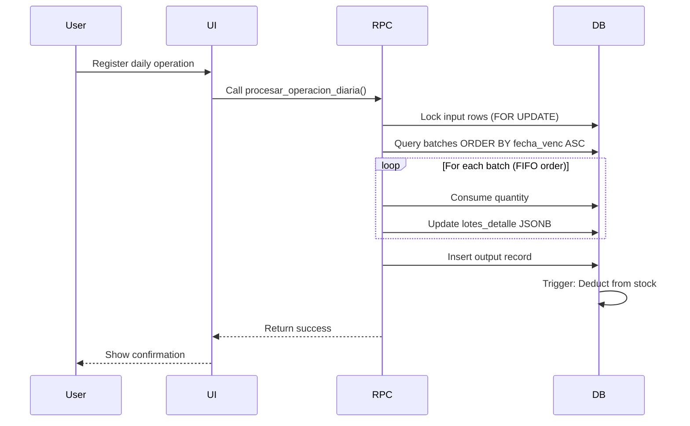

## Overview

The PAE Inventory System uses **FIFO (First-In-First-Out)** batch tracking to ensure that the oldest products are used first, minimizing waste from expired items.

Every product entry is tracked with detailed batch information including quantities and expiration dates. When inventory is consumed, the system automatically selects batches with the nearest expiration dates.

## What is FIFO?

**FIFO = First In, First Out**

It means the first items added to inventory are the first items used. In food inventory management, this prevents:
- Products expiring before they can be used
- Waste from spoilage
- Using newer items while older items sit unused

### Example

You receive rice deliveries:

| Date Received | Quantity | Expiration Date | Batch Status |
|---------------|----------|-----------------|-------------|
| Feb 1 | 50 kg | May 1 | ← Use this first (oldest) |
| Feb 15 | 30 kg | June 15 | ← Use this second |
| Mar 1 | 40 kg | July 1 | ← Use this last (newest) |

When you cook on Mar 5 and need 60 kg of rice, FIFO automatically:
1. Uses **all 50 kg** from the Feb 1 batch (expires soonest)
2. Uses **10 kg** from the Feb 15 batch
3. Leaves **20 kg** remaining in Feb 15 batch and all 40 kg in Mar 1 batch

## How Batches Are Created

Batches are registered when creating entry guides (guías de entrada).

### Single Batch Entry

If all products in a delivery have the same expiration date:

<Steps>
  <Step title="Add the product">
    Select the product and enter the total quantity (e.g., 100 kg Arroz).
  </Step>
  
  <Step title="Register one batch">
    - Cantidad Lote: `100`
    - Vencimiento: `2026-08-15`
  </Step>
</Steps>

### Multiple Batch Entry

If the same product has different expiration dates (mixed batches):

<Steps>
  <Step title="Add the product">
    Enter total quantity: `150 kg`
  </Step>
  
  <Step title="Click '+ Agregar Lote' for each batch">
    **Lote 1:**
    - Cantidad: `80`
    - Vencimiento: `2026-07-01`
    
    **Lote 2:**
    - Cantidad: `70`
    - Vencimiento: `2026-09-15`
  </Step>
  
  <Step title="Verify the sum">
    The system checks: 80 + 70 = 150 ✓
    
    If the sum doesn't match the total, it will reject the entry.
  </Step>
</Steps>

### Validation (GuiasEntrada.jsx:159-177)

```javascript
// Validate batches
for (let i = 0; i < detalles.length; i++) {
  const detalle = detalles[i]

  for (let j = 0; j < detalle.lotes.length; j++) {
    const lote = detalle.lotes[j]
    if (!lote.cantidad || !lote.fecha_vencimiento) {
      notifyWarning('Datos incompletos', 
        `Rubro ${i + 1}, Lote ${j + 1}: Complete cantidad y fecha de vencimiento`)
      return
    }
  }

  const sumaLotes = detalle.lotes.reduce((sum, lote) => sum + parseFloat(lote.cantidad || 0), 0)
  const cantidadTotal = parseFloat(detalle.amount || 0)

  if (Math.abs(sumaLotes - cantidadTotal) > 0.01) {
    notifyWarning('Lotes no coinciden', 
      `Rubro ${i + 1}: La suma de lotes (${sumaLotes}) no coincide con la cantidad total (${cantidadTotal})`)
    return
  }
}
```

## Batch Storage Format

Batches are stored as JSONB arrays in the `input.lotes_detalle` column.

### Database Structure (supabase_schema.sql:100-114)

```sql
CREATE TABLE IF NOT EXISTS input (
    id_input SERIAL PRIMARY KEY,
    id_guia INTEGER REFERENCES guia_entrada(id_guia) ON DELETE CASCADE,
    id_product INTEGER REFERENCES product(id_product),
    amount NUMERIC(10,2) NOT NULL CHECK (amount > 0),
    unit_amount INTEGER, -- cantidad en bultos si aplica
    lotes_detalle JSONB, -- [{cantidad, fecha_vencimiento}]
    fecha DATE DEFAULT CURRENT_DATE,
    created_at TIMESTAMPTZ DEFAULT NOW()
);

-- GIN index for fast JSONB searches
CREATE INDEX IF NOT EXISTS idx_input_lotes_detalle ON input USING GIN (lotes_detalle);
```

### JSONB Format Example

```json
[
  {
    "cantidad": 80.00,
    "fecha_vencimiento": "2026-07-01"
  },
  {
    "cantidad": 70.00,
    "fecha_vencimiento": "2026-09-15"
  }
]
```

## How FIFO Consumption Works

When you register a daily operation, the system:

1. **Calculates quantity needed** (attendance ÷ portion yield)
2. **Finds all batches** for the product from approved entry guides
3. **Sorts by expiration date** (oldest first)
4. **Consumes batches** one by one until the needed quantity is fulfilled
5. **Updates batch quantities** (deducts from JSONB arrays)
6. **Updates total stock** (triggers automatic stock decrease)

### FIFO Query (supabase_schema.sql:632-647)

```sql
-- Consume using FIFO (oldest expiration dates first)
FOR v_lote IN
  SELECT
    i.id_input,
    (lote.value->>'cantidad')::NUMERIC(10,2) AS cantidad_lote,
    (lote.value->>'fecha_vencimiento')::DATE AS fecha_venc,
    (lote.ordinality - 1)::INTEGER AS lote_idx
  FROM input i
  JOIN guia_entrada g ON i.id_guia = g.id_guia
  CROSS JOIN LATERAL jsonb_array_elements(i.lotes_detalle) WITH ORDINALITY AS lote
  WHERE i.id_product = v_rubro_id
    AND g.estado = 'Aprobada'  -- ← Only approved guides
    AND i.lotes_detalle IS NOT NULL
    AND jsonb_array_length(i.lotes_detalle) > 0
    AND (lote.value->>'cantidad')::NUMERIC > 0  -- ← Skip empty batches
  ORDER BY (lote.value->>'fecha_vencimiento')::DATE ASC, i.id_input ASC  -- ← FIFO order
LOOP
  EXIT WHEN v_restante <= 0;

  -- Consume from this batch...
```

Key points:
- `ORDER BY fecha_vencimiento ASC` - Oldest dates first
- Only processes batches from **Aprobada** guides (not Pendiente or Rechazada)
- Skips batches that are already depleted (`cantidad > 0`)
- Uses `WITH ORDINALITY` to track position in JSONB array

### Batch Consumption Logic (supabase_schema.sql:648-660)

```sql
-- Consume from this batch
v_consumir := LEAST(v_lote.cantidad_lote, v_restante);

-- Update batch quantity in JSONB array
UPDATE input
SET lotes_detalle = jsonb_set(
  lotes_detalle,
  ARRAY[v_lote.lote_idx::TEXT, 'cantidad'],
  to_jsonb(v_lote.cantidad_lote - v_consumir)
)
WHERE id_input = v_lote.id_input;

v_restante := v_restante - v_consumir;
```

**How it works:**
- `v_consumir = LEAST(batch_amount, remaining_needed)` - Take only what's needed or available
- `jsonb_set()` - Updates the specific batch's quantity in the JSONB array
- `v_restante` - Tracks how much more we still need
- Loop continues until `v_restante <= 0` or no more batches available

### Example Consumption Scenario

**Initial state:**
```
Arroz inventory:
  Batch A: 50 kg (expires 2026-05-01)
  Batch B: 30 kg (expires 2026-06-15)
  Batch C: 40 kg (expires 2026-07-01)

Daily operation needs: 60 kg
```

**FIFO process:**
```
1. Start: Need 60 kg
2. Check Batch A (expires soonest): Has 50 kg
   - Consume: 50 kg from Batch A
   - Remaining needed: 60 - 50 = 10 kg
   - Batch A new quantity: 0 kg

3. Check Batch B: Has 30 kg
   - Consume: 10 kg from Batch B (only need 10)
   - Remaining needed: 10 - 10 = 0 kg ✓ Done
   - Batch B new quantity: 20 kg

4. Batch C: Not touched (still has 40 kg)
```

**Final state:**
```
Arroz inventory:
  Batch A: 0 kg (depleted)
  Batch B: 20 kg (partially consumed)
  Batch C: 40 kg (untouched)
```

## Concurrency Protection

The system uses PostgreSQL row-level locking to prevent race conditions when multiple operations happen simultaneously.

### Batch Locking (supabase_schema.sql:621-629)

```sql
-- Lock relevant batch rows (FIFO)
PERFORM NULL
FROM input i
JOIN guia_entrada g ON i.id_guia = g.id_guia
WHERE i.id_product = v_rubro_id
  AND g.estado = 'Aprobada'
  AND i.lotes_detalle IS NOT NULL
  AND jsonb_array_length(i.lotes_detalle) > 0
FOR UPDATE OF i;  -- ← Locks the input rows
```

This ensures:
- Two operations processing the same product at the same time don't cause conflicts
- Batch quantities are updated atomically
- No batch can be over-consumed

## Viewing Batches with Upcoming Expiration

The system provides a function to query batches expiring soon.

### get_lotes_por_vencer() Function (supabase_schema.sql:534-568)

```sql
CREATE OR REPLACE FUNCTION get_lotes_por_vencer(p_dias INTEGER DEFAULT 30)
RETURNS TABLE(
  id_product INTEGER,
  product_name TEXT,
  stock NUMERIC(10,2),
  unit_measure TEXT,
  category_name TEXT,
  fecha_vencimiento DATE,
  cantidad_lote NUMERIC(10,2),
  dias_restantes INTEGER
)
LANGUAGE plpgsql
SECURITY DEFINER
AS $$
BEGIN
  RETURN QUERY
  SELECT
    p.id_product, p.product_name, p.stock, p.unit_measure,
    c.category_name,
    (lote->>'fecha_vencimiento')::DATE,
    (lote->>'cantidad')::NUMERIC(10,2),
    ((lote->>'fecha_vencimiento')::DATE - CURRENT_DATE)::INTEGER
  FROM input i
  JOIN guia_entrada g ON i.id_guia = g.id_guia
  JOIN product p ON i.id_product = p.id_product
  LEFT JOIN category c ON p.id_category = c.id_category
  CROSS JOIN LATERAL jsonb_array_elements(i.lotes_detalle) AS lote
  WHERE g.estado = 'Aprobada'
    AND i.lotes_detalle IS NOT NULL
    AND jsonb_array_length(i.lotes_detalle) > 0
    AND (lote->>'fecha_vencimiento')::DATE <= CURRENT_DATE + p_dias * INTERVAL '1 day'
  ORDER BY (lote->>'fecha_vencimiento')::DATE;
END;
$$;
```

**Usage:**
```sql
-- Get batches expiring in the next 30 days
SELECT * FROM get_lotes_por_vencer(30);

-- Get batches expiring in the next 7 days (urgent)
SELECT * FROM get_lotes_por_vencer(7);
```

This helps you:
- Identify products that need to be used soon
- Plan menus around expiring items
- Reduce waste from expired products

## Batch Quantity Zero vs. Deletion

<Note>
The system **never deletes** batch records. When a batch is fully consumed, its quantity is set to 0 but the record remains for audit purposes.
</Note>

**Why keep depleted batches?**
- Maintains complete audit trail
- Can track when batches were consumed
- Historical data for inventory reports

**FIFO query handles this:**
```sql
AND (lote.value->>'cantidad')::NUMERIC > 0  -- ← Skips zero batches
```

## Best Practices

<AccordionGroup>
  <Accordion title="Always register accurate expiration dates">
    Enter the exact expiration date from the product packaging. For perishables without printed dates, estimate conservatively:
    - Leafy vegetables: 3-5 days
    - Root vegetables: 7-14 days
    - Fresh meat: 2-3 days (if frozen, use freezer guidelines)
  </Accordion>
  
  <Accordion title="Use separate batches for different expiration dates">
    Even if it's the same delivery, if products have different expiration dates, register them as separate batches.
    
    ✓ Good:
    - Lote 1: 50 kg, expires 2026-07-01
    - Lote 2: 50 kg, expires 2026-08-15
    
    ✗ Bad:
    - Lote 1: 100 kg, expires 2026-07-15 (averaged - loses FIFO accuracy)
  </Accordion>
  
  <Accordion title="Check expiring batches regularly">
    Use the `get_lotes_por_vencer()` function or implement a dashboard widget to monitor batches expiring soon.
    
    Set up a routine:
    - Weekly: Check batches expiring in next 14 days
    - Daily: Check batches expiring in next 3 days
  </Accordion>
  
  <Accordion title="Understand FIFO is automatic">
    You don't need to manually select which batches to use. The system automatically handles FIFO when you register daily operations.
    
    Just enter:
    - Attendance count
    - Products cooked
    
    FIFO happens automatically behind the scenes.
  </Accordion>
  
  <Accordion title="Trust the batch validation">
    If the system rejects your entry guide because "Lotes no coinciden", don't override it. Fix the batch quantities so they sum to the total amount.
    
    This validation prevents inventory discrepancies.
  </Accordion>
</AccordionGroup>

## Common Questions

<AccordionGroup>
  <Accordion title="What if I receive products with no expiration date?">
    For fresh produce or items without printed dates:
    
    1. **Estimate conservatively** based on the product type
    2. **Use a standard shelf life** for that category
    3. **Document in notes** that the date is estimated
    
    Example: "Tomates - vida útil estimada 5 días"
  </Accordion>
  
  <Accordion title="Can I manually choose which batch to use?">
    No. The system always uses FIFO to prevent waste and ensure food safety. You cannot override this behavior.
    
    If you need to use a specific batch (e.g., damaged packaging), you would need to:
    1. Create a manual output record for that specific batch
    2. This is an advanced operation - consult with a Desarrollador
  </Accordion>
  
  <Accordion title="What happens if FIFO finds insufficient batches?">
    The operation is **rejected** with an error message:
    
    "Lotes insuficientes para 'Arroz'. Faltan 5.00 unidades."
    
    This means:
    - You tried to consume more than available in approved batches
    - You need to either:
      - Approve pending entry guides
      - Reduce the quantity needed (lower attendance or remove product)
      - Receive new inventory
  </Accordion>
  
  <Accordion title="How do I see which batches were used in a past operation?">
    Batch consumption is tracked at the database level but not displayed in the UI by default.
    
    To trace consumption:
    1. Check the `output` table for the operation date and products
    2. Query `input.lotes_detalle` to see batch quantities before/after
    3. Check `audit_log` for detailed operation records
    
    This requires database access - contact a Desarrollador for complex audit queries.
  </Accordion>
  
  <Accordion title="What if I entered the wrong expiration date?">
    Currently, there's no UI to edit batches after an entry guide is created.
    
    If the guide is still **Pendiente**:
    - The Director can reject it
    - You can create a new guide with correct information
    
    If the guide is already **Aprobada**:
    - Contact a Desarrollador to fix the batch data directly in the database
    - Document the correction in the guide's comments
  </Accordion>
</AccordionGroup>

## Technical Implementation Summary

### Data Flow



### Key Technologies

- **JSONB columns** - Flexible batch array storage
- **GIN indexes** - Fast JSONB queries
- **Row-level locking** - Concurrency control
- **Database triggers** - Automatic stock updates
- **SECURITY DEFINER functions** - Controlled execution

## Related Resources

<CardGroup cols={2}>
  <Card title="Entry Guide Workflow" icon="check-circle" href="/guides/entry-approval-workflow">
    How batches are created when registering inventory entries
  </Card>
  <Card title="Daily Operations" icon="calendar-check" href="/guides/daily-attendance">
    How FIFO consumption happens during meal service
  </Card>
  <Card title="Managing Products" icon="box" href="/guides/managing-products">
    Understanding product stock levels
  </Card>
</CardGroup>