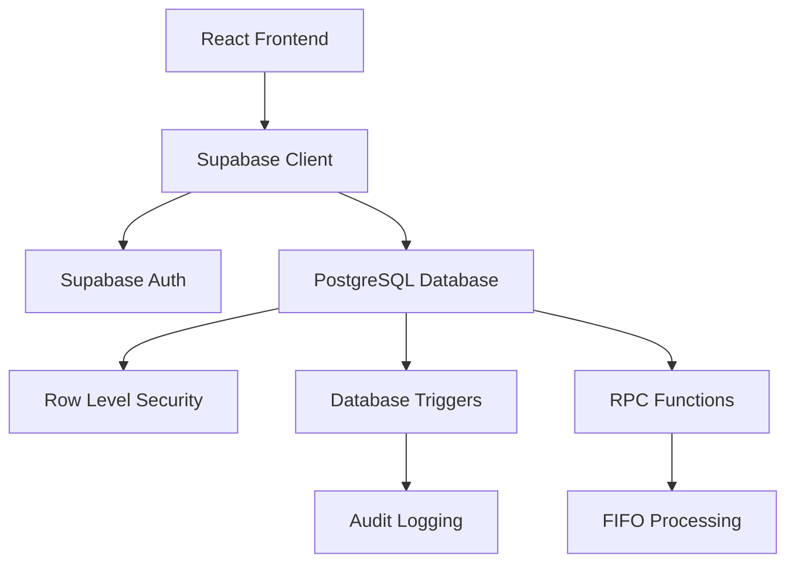

## Overview

PAE Inventory System is a comprehensive web-based solution for managing the **Programa de Alimentación Escolar** (School Food Program) at Escuela Nacional Maestro Carlos González. Built with modern technologies, it streamlines inventory tracking, menu planning, and daily operations for school cafeteria management.

<CardGroup cols={2}>
  <Card
    title="Quick Start"
    icon="rocket"
    href="/quickstart"
  >
    Get up and running in minutes with our step-by-step guide
  </Card>
  <Card
    title="Installation"
    icon="download"
    href="/installation"
  >
    Set up your local development environment
  </Card>
  <Card
    title="User Management"
    icon="users"
    href="/admin/user-management"
  >
    Learn about roles and permissions
  </Card>
  <Card
    title="Inventory Tracking"
    icon="boxes-stacked"
    href="/features/inventory-management"
  >
    Manage products, stock levels, and categories
  </Card>
</CardGroup>

## Key Features

### Inventory Management
Track food items, stock levels, and categories with real-time updates. The system supports multiple units of measurement (kg, liters, units) and provides low-stock alerts.

### FIFO & Batch Tracking
Automatic First-In-First-Out (FIFO) inventory management with detailed batch tracking including expiration dates. The system alerts you when items are approaching expiration.

### Maker-Checker Workflow
Two-step approval process for incoming deliveries (guías de entrada). Staff can create entries, but only Directors can approve them to update inventory levels.

### Role-Based Access Control
Four distinct user roles with granular permissions:
- **Director** - Full administrative access
- **Madre Procesadora** - Operational kitchen and inventory management
- **Supervisor** - Read-only access for oversight
- **Desarrollador** - Technical administrator (database-level only)

### Daily Operations
Register daily attendance and menu planning for breakfast, lunch, and snacks. The system automatically calculates portion requirements and updates inventory using FIFO logic.

### Comprehensive Reporting
Generate reports on inventory levels, historical transactions, audit logs, and daily operations. All actions are tracked for accountability.

## Technology Stack

The PAE Inventory System is built with modern, reliable technologies:

<CardGroup cols={3}>
  <Card title="React 18" icon="react">
    Modern UI with hooks and functional components
  </Card>
  <Card title="Supabase" icon="database">
    PostgreSQL database with real-time subscriptions
  </Card>
  <Card title="Vite" icon="bolt">
    Lightning-fast build tool and dev server
  </Card>
  <Card title="Tailwind CSS" icon="palette">
    Utility-first CSS framework
  </Card>
  <Card title="React Router" icon="route">
    Client-side routing and navigation
  </Card>
  <Card title="Lucide Icons" icon="icons">
    Beautiful, consistent icon library
  </Card>
</CardGroup>

## Architecture

The system follows a modern SaaS architecture:

<Note>
  The system uses Supabase Row Level Security (RLS) policies to enforce permissions at the database level, ensuring data security even if client-side validation is bypassed.
</Note>

## Database Structure

Key database tables and their relationships:

- **users** - User accounts linked to Supabase Auth
- **rol** - User role definitions (Director, Madre Procesadora, etc.)
- **product** - Product catalog with stock levels
- **category** - Product categories (Lácteos, Proteínas, etc.)
- **guia_entrada** - Incoming delivery guides (with approval workflow)
- **input** - Delivery line items with FIFO batch tracking
- **output** - Inventory withdrawals for daily operations
- **registro_diario** - Daily attendance and meal service records
- **receta_porcion** - Portion yield per product
- **audit_log** - Comprehensive audit trail

<Warning>
  The database schema includes legacy tables (`asistencia_diaria`, `menu_diario`, `menu_detalle`) that have been replaced by `registro_diario`. Do not use these tables for new features.
</Warning>

## Security Features

<AccordionGroup>
  <Accordion title="Row Level Security (RLS)">
    All tables use Supabase RLS policies to restrict access based on user roles. Even with direct database access, users can only see and modify data they're authorized to access.
  </Accordion>
  
  <Accordion title="Database Triggers">
    PostgreSQL triggers enforce business rules:
    - Prevent unauthorized role changes
    - Automatically update stock on transactions
    - Log all critical operations to audit trail
  </Accordion>
  
  <Accordion title="Maker-Checker Workflow">
    Separation of duties for inventory updates:
    - Staff creates delivery guides
    - Directors approve/reject before stock updates
    - All approvals are logged with timestamps
  </Accordion>
  
  <Accordion title="Audit Trail">
    Every INSERT, UPDATE, DELETE, APPROVE, and REJECT operation is logged with:
    - User ID and timestamp
    - Table and record affected
    - Complete before/after data
    - IP address tracking
  </Accordion>
</AccordionGroup>

## Next Steps

<Steps>
  <Step title="Quick Start">
    Follow the [Quick Start Guide](/quickstart) to create an account and explore the system
  </Step>
  <Step title="Set Up Development">
    Clone the repository and follow the [Installation Guide](/installation) for local development
  </Step>
  <Step title="Explore Features">
    Learn about [User Management](/admin/user-management), [Inventory Tracking](/features/inventory-management), and [Daily Operations](/features/daily-operations)
  </Step>
  <Step title="Review Security">
    Understand the [Security Model](/database/security) and [Database Schema](/database/overview)
  </Step>
</Steps>

## Support

For questions, issues, or feature requests, contact the development team or refer to the source code documentation.

<Check>
  Ready to get started? Head over to the [Quick Start Guide](/quickstart)!
</Check>